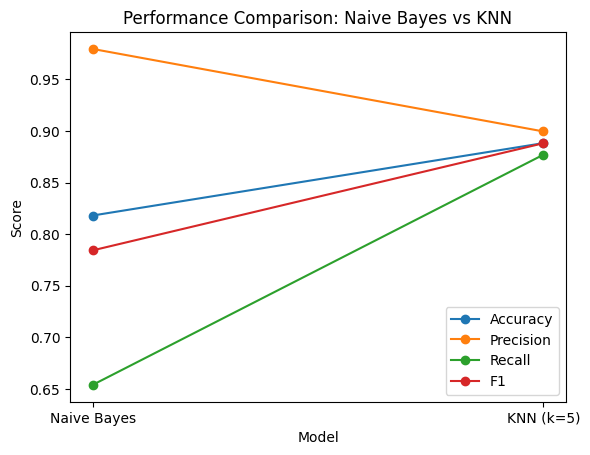
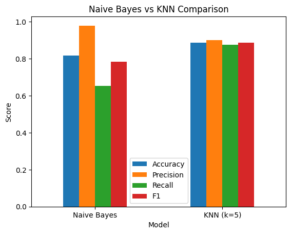
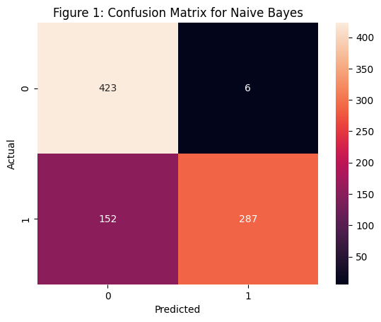
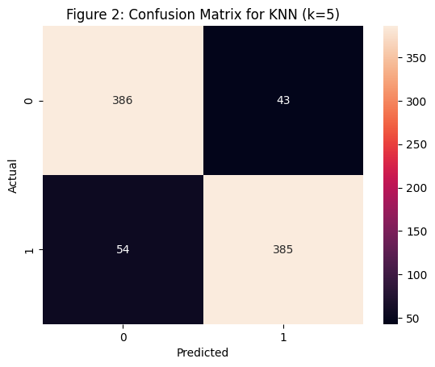
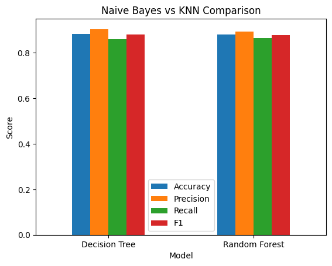
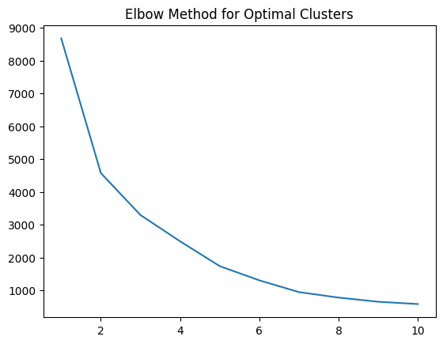
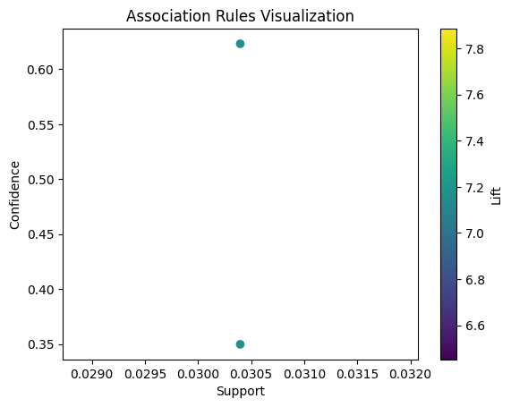
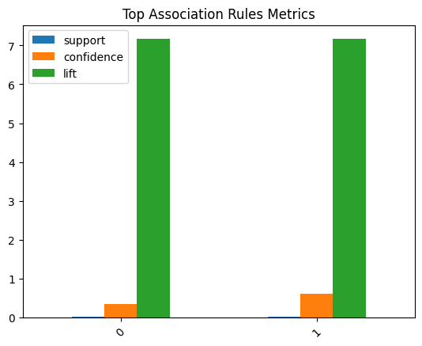

# Customer Value Prediction & Market Basket Analysis

## Turning Retail Data into Actionable Insights

This project applies data mining techniques to transform raw transactional data into meaningful business insights. Using the Online Retail Dataset, it identifies high-value customers, evaluates machine learning models, and uncovers hidden product relationships.

---

## Project Overview

* Dataset: Online Retail Dataset (UCI)
* Goal: Predict customer value and discover purchasing patterns
* Approach: Classification, Clustering, and Association Rule Mining

---

## Models Used

* Naive Bayes
* K-Nearest Neighbors (KNN)
* Decision Tree (CART)
* Random Forest

---

## Model Performance

| Model         | Accuracy | Precision | Recall | F1-Score |
| ------------- | -------- | --------- | ------ | -------- |
| Naive Bayes   | 0.8180   | 0.9795    | 0.6538 | 0.7842   |
| KNN (k=5)     | 0.8882   | 0.8995    | 0.8770 | 0.8881   |
| Decision Tree | 0.8825   | 0.9041    | 0.8588 | 0.8808   |
| Random Forest | 0.8790   | 0.8920    | 0.8656 | 0.8786   |

---

## Visual Insights

### Model Comparison (Naive Bayes vs KNN)



### Model Comparison (Bar Chart)



### Confusion Matrix — Naive Bayes



### Confusion Matrix — KNN (k=5)



### Tree-Based Model Comparison



### Clustering (Elbow Method)



### Association Rules (Scatter Plot)



### Association Rules (Metrics)



---

## Key Findings

* KNN (k=5) achieved the best overall performance
* Naive Bayes showed high precision but lower recall
* Tree-based models performed competitively
* Optimal clusters identified: 2–3
* Strong product association found (Lift ≈ 7.17)

---

## Business Impact

* Identify and target high-value customers
* Improve marketing strategies
* Enable product recommendation systems
* Support data-driven decision making

---

## Technologies Used

* Python
* Pandas, NumPy
* Scikit-learn
* Matplotlib, Seaborn
* Mlxtend

---

## Project Structure

```
├── Data_Mining_Project_Forkan_Amin.ipynb
├── Online Retail.xlsx
├── Project_Code_PDF.pdf
├── README.md
├── 1.png  (Elbow Method)
├── 2.png  (Naive Bayes Confusion Matrix)
├── 3.png  (KNN Confusion Matrix)
├── 4.png  (Bar Comparison)
├── 5.png  (Tree Model Comparison)
├── 6.png  (Line Comparison)
├── 7.png  (Association Metrics)
├── 8.png  (Association Scatter)
```

---

## Conclusion

This project demonstrates how combining supervised and unsupervised learning techniques can generate meaningful insights from retail data. It highlights the importance of selecting models based on business objectives rather than relying solely on accuracy.

---

## Author

Forkan Amin
M.Sc. in Applied Statistics & Data Science
